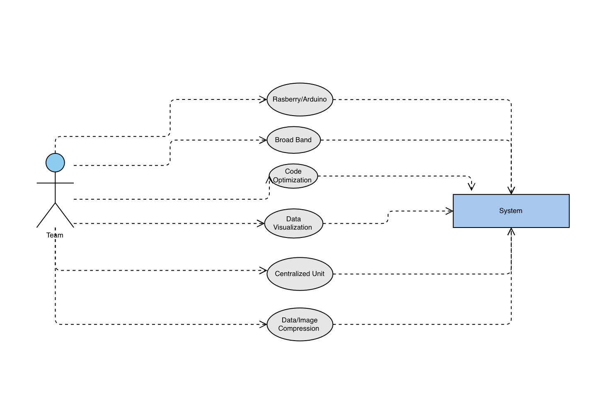
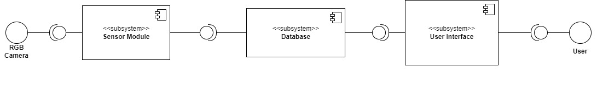
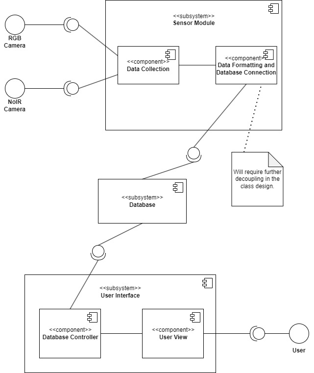

## AGIcam Image Data Processing

Agricultural IOT camera system

**AgroDevs**

Abhilash Ambati

Zachary Hall

Jordan Muehlbauer

**Table of Contents**

I. **Introduction**									
II. Team Members - Bios and Project Roles  
III. Project Description and Clarification  
	1. Introduction  
	2. Background and Related Work  
	3. Project Overview  
	4. Client and Stakeholder Identification and Preferences  
IV. Project Requirements and Specifications
	1. Introduction  
	2. System Requirements Specification  
		2.1. Use Cases  
		2.2. Functional Requirements  
			2.2.1. Sensor's Processor  
			2.2.2.  Central hub/User Interface  
			2.2.3. Database
		2.3. Non-Functional Rquirements  
	3. System Evolution  
V. Project Solution Approach
	1. Introduction  
	2. System Overview  
	3. Architecture Design  
		3.1. Overview  
		3.2. Subsystem Decomposition  
			3.2.1. Sensor Module  
			3.2.2. Database  
			3.2.3. User Interface  
	4. Data design  
	5. User Interface Design  
VI. Testing and Acceptance Plan  
	1. Introduction  
	2. Testing Strategy  
	3. Test Plans  
		3.1. Unit Testing  
		3.2. Integration Testing  
		3.3. System Testing  
			3.3.1. Functional Testing  
			3.3.2. Performance Testing  
			3.3.3. User Acceptance Testing  
	4. Environment Requirements  
VII. Alpha Prototype
	1. Introduction  
	2. Alpha Prototype Description  
		2.1. **INCLUDE SUBSYSTEMS AND THEIR FUNCTIONS/INTERFACES IMPLEMENTED AND PRELIMINARY TESTS**  
	3. Alpha Prototype Demonstration  
	4. Future Work  
VII. Glossary  
IV. References  
V. Appendices  

# I. Introduction

Originating from Pullman WA, Washington State University Phenomics lab developed an Auridino-based IOT camera system 
known as AGIcam. This camera is tasked with monitoring crop conditions in remote fields. AgroDevs is a team of 3 WSU 
computer science students tasked with evaluating and improving data transfer and compression as well as evaluating edge 
computing and minimal power consumption solutions. Improving these aspects will allow for AGIcam to provide a better 
user experience and reduce overhead for farms using the sensor. Our team is working directly with Dr. Sankaran to meet 
these goals and advance the prosperity of  AGIcam.

This project intends to allow farmers to remotely monitor their crops. It will achieve this by enabling the farmer to 
record data at user-specified intervals from sensors scattered throughout their farm. The sensors will then send the 
data to a central control hub. This hub then stores the data and allows the farmer to access the data. 
The idea behind this is to save farm resources by minimizing time spent by the farmer in the field.

# II. Team Members - Bios and Project Roles
- Zachary Hall's roll in this project was team lead. The main responsiblity of this was communicatoin between the client and the development team. He is a computer science major at Washington State University. His prior experiences include building a linux file system, a flask based web application, and a Mandelbrot Set picture generator. He has helped throughout the project but mostly in programing the WittyPi module, remote configuration, and monitoring the sensor.

 - Jordan Muehlbauer is a computer science student attending Washington State University. His prior projects and experience include orchastrating large game servers, doing website development and contributing to embedded operating systems. He is well versed in system design, Java, C++ and Python. For this project he has been responsible for creating the database, creating the capture and upload executable and providing support for database interaction to other team members while working on their parts.
- Abhilash Ambati is a computer science student attending Washington State University. His prior project and experiences include web development, sms spam filter and data minning. He is well versed in c++, python and HTML.For this project he has been responsible for convertinf the code from python to c++ and helped capturing multiple images and completed part of Remote Configuration.

# III. Project Description and Clarification
## 1. Introduction

Originating from Pullman WA, Washington State University Phenomics lab developed an Auridino based IOT camera system known as AGIcam. This camera is tasked with monitoring the crop conditions in remote fields. AgroDevs is a team of 3 WSU computer science students tasked with evaluating and improving data transfer and compression as well as evaluating edge computing and minimal power consumption solutions. Improving these aspects will allow for AGIcam to provide a better user experience and reduce overhead for farms using the sensor. Our team is working directly with Dr. Sankaran to meet these goals and advance the prosperity
of AGIcam.

## 2. Background and Related Work

Plant phenotyping is the process of assessing the “growth, development, tolerance, resistance, architecture, physiology,
ecology, yield, and the basic measurement of individual quantitative parameters” [1] of plant life. It is key in farmers’ 
plant selection process as well as the research surrounding sustainable farming. Researchers are currently trying to 
develop standardization for large datasets of plant phenotyping [2].

Through phenotyping, the project’s goal was to “allow plant breeders to monitor multiple trials for timely crop 
management” [3]. This was done by creating a low-cost sensor system with dual cameras that collected data at 
user-defined intervals. This system could be used to both monitor current crops and test how well certain crops grow 
in certain temporal weather environments (i.e. this wheat strain did best during this weather pattern). 
This combination would allow for better wheat strain selection and current crop management both leading to increased plant yield.

Systems operations for the sensor system were programmed using a Linux-based operating system Raspbain Buster. 
These systems were commanded using Python 3 (Python Core Team 2015) [3]. The Python library Picamera was key in 
programming the cameras to capture images at user-defined intervals. The cameras would automatically adjust white 
balance, image resolution, frame rate, exposure mode, and shutter speed associated with lighting conditions. 
This allowed for two images to be captured (one RGD and one NoIR from the respective cameras), combined into one 
side-by-side image, and stored on an SD card. A commonly used, robust weather system was used to collect weather data.

After data was collected, image processing took place. There was four main steps [3]:

1. Image separation (separating the RGB and NoIR images)
2. Vegetation index calculation (NoIR image used for computation)
3. Plot segmentation (Regions of interests created)
4. Data extraction (NDVI value was calculated from the region of interests)

Once the NDVI value was obtained, it was added to a CSV file with the following format [3]:

* Date: date of data acquisition
* Time: time of data acquisition
* Mean: mean of NDVI value
* Median: median of NDVI value
* STD: standard deviation of NDVI value
* Maximum: maximum of NDVI value
* QT75: average of the highest 25% of NDVI value
* QT90: average of the highest 10% of NDVI value
* Plot: plot number on the field trial

From here, image analysis was done using Python 3 and mostly OpenCV library. The system can be used to find different 
vegetation indices representing canopy vigor, crop health, growth rate, and different stages of crop growth and development [3].

Related work that may be beneficial to the project is the concept of edge computing, data transfer efficiency, 
and eventually machine learning algorithms. Edge computing is a method of improving data transfer efficiency by doing 
a lot of the processing locally before burdening the network with unnecessary data transfer [4].

The provided recourse [3] may be outdated compared to where the project currently is. The current state of data transfer 
is unknown, but we believe it has evolved past physically transferring SD cards.

## 3. Project Overview

Currently, the client wants us to improve data transfer algorithms in order to improve the battery life of the sensor. 
Our main goal is to decrease power consumption as much as possible. Sensor battery life is currently limited to five 
days [3] and the data transfer process can be optimized. To do this, we will be exploring edge computing and 
data transfer algorithms. Until we have a better understanding of the current system, and what options the client 
has already explored, it is difficult to understand how this will be done beyond speculation. Eventually, once this 
part of the project is optimized, we will have the option of improving image processing possibly using machine learning.

The data transfer process will eventually be updated from physically transferring SD cards to a network-based system. 
Edge computing would then allow for improved data transfer efficiency. This could involve having the sensor nodes 
take care of the image processing step, or having the sensor nodes transfer their data to an intermediate node that 
takes care of image processing and combining data into a CSV file which is transferred to the centralized hub. Outside of edge computing other efficient data transfer algorithms will be explored once current hardware is better understood.

Once the data transfer process is optimized and finalized we will have the option of exploring image processing using machine learning. While what we will be able to contribute in the given time scale will be limited, we hope to leave the client with at least a minimal machine-learning model that can be used as a skeleton for future image-processing work.

##  4. Client and Stakeholder Identification and Preferences 

Washington State University Phenomics lab developed an Aurdino-based IOT camera system known as AGIcam that monitors 
crop conditions in remote fields. The main goal of  AgroDevs is to improve the functionality of the system that is 
currently being used. In the AGIcam, we will be working on improving the efficiency of the system such as reducing the 
power usage of the microcontroller and the power usage during a data transfer and also making sure that the data 
transfer efficiency can be associated with data format during edge computing.

The main purpose of the AGIcam is to make sure that the crop conditions are optimal and to make sure we get the most 
yield possible, by improving these aspects we make sure that AGI cam can provide a better user experience and 
reduce the damage to sensors.

AGIcam is a federally funded program that targets aspects like food security, crop improvement, and the breeding process.

The AGIcam is currently being tested on  Andrew Nelson, Nelson Farm, these farms under the supervision of Sankaran, 
Sindhuja is being tested with AGIcam, and our improvements will affect the yield and the user interface.

# IV. Project Requirements and Specifications

## 1. Introduction

This project intends to allow farmers to remotely monitor their crops. It will achieve this
by allowing the farmer to record data at user-specified intervals from sensors scattered
throughout their farm. The data will then be sent by the sensors to a central control hub. This
hub then stores the data and allows the farmer to access the data. The idea behind this is to
save farm resources by minimizing time spent by the farmer in the field.

This document is split into two sections: system requirements specification and system
evolution. System requirements specification section describes what is required of the system
based on the stakeholders use cases. This section is further broken down into the subsections
use cases (representing stakeholders’ use cases), functional requirements (what is required of
the system to implement the use cases), and non-functional requirements
(constraints/requirements on the design of the system beyond functionality). The following
section is system evolution that describes how the system will evolve throughout development.
The final sections are the glossary and references which should be self explanatory.

## 2. System Requirements Specification

The client wants us to improve data transfer algorithms in order to improve the battery life of the sensor. 
Our main goal is to decrease power consumption as much as possible. The system currently uses a Raspberry Pi 
camera module to capture images in specified intervals for image processing, the module is working properly but it’s 
not efficient to make it more efficient the team will have to research and decide if they should keep using the 
Raspberry Pi camera module or change it to Arduino. Addition with these camera modules there are multiple sensors 
that are being used to keep track of temperature, moisture, and crop health currently the data from these sensors have 
been processed separately since we have an option to use a centralized unit to process the data from these sensors 
we have to research if using a  centralized unit will help or decide to keep processing the data separately. 

	
The current system is designed to work on larger-scale farms, but there is an issue with this, the current broadband 
used is not strong enough to receive data after a certain distance, and the team needs to research and decide which 
broadband will best match and satisfy the desired area. In order to make the system more efficient, the team has to 
research and find better ways to do Data/image compression-decompression and also come up with better data 
visualization tools, the current data visualization and Data/image compression/decompression code are in python 
which is not the best match for the system, the team has to optimization the code and decide which language to 
optimization the code in.

### 2.1.  	Use Cases 

### 2.2. Functional Requirements

Below lists the functional requirements for each of the system's parts.  These parts include the sensors’ processor, central hub/user interface, and database.

#### 2.2.1 Sensor's Processor

1. **Take RBG and NoIR pictures**
    i. The processor should be able to take pictures from both cameras, at the same time, at user-specified intervals
    ii. Maps to the user being able to collect data
    iii. Priority Level: 0
2. **Combine data from different cameras and sensors**
    i. The processor should be able to combine the RBG and NoIR images that were taken at the same time, associate the image with a timestamp, and combine other data taken at the sensor at the same time. This could include weather data.
    ii. Maps to the user being able to collect data
    iii. Priority Level: 0
3. **Compress the data**
    i. The processor should be able to compress the combined data for it to be sent to the central hub
    ii. Maps to the user being able to collect data
    iii. Priority Level: 1
4. **Send the data to the central hub**
    i. The processor should be able to send the compressed data to the central hub
    ii. Maps to the user being able to collect data
    iii. Priority Level: 0

#### 2.2.2. Central hub/User Interface

1. **Allow users to request data**
    i. The system should allow users to request data from the database
    ii. Maps to the user being able to see data
    iii. Priority Level: 0
2. **Display the requested data in a way that is organized and easy to interpret**
    i. The system should display the data in a way that is easy to understand. It should group data by sensor number and timestamp.
    ii. Maps to the user being able to see data
    iii. Priority Level: 0
3. **Receive data**
    i. The system should be able to receive data from multiple nodes
    ii. Maps to the user being able to collect data
    iii. Priority Level: 0
4. **Decompress data**
    i. The system should be able to decompress received data
    ii. Maps to the user being able to collect data
    iii. Priority Level: 1
5. **Store data in the database**
    i. The system should be able to store collected data in a database
    ii. Maps to the user being able to collect data
    iii. Priority Level: 0
6. **Retrieve requested data**
    i. The system should be able to retrieve data from the database
    ii. Maps to the user being able to see data
    iii. Priority Level: 0
7. **Set sensor time intervals**
    i. The system should allow the user to adjust the time intervals on a specified sensor, or globally across all sensors
    ii. Maps to the user being able to collect data
    iii. Priority Level: 2

#### 2.2.3. Database

1. **Store data from sensors**
    i. The database should store the data received from the central hub
    ii. Maps to the user being able to collect data
    iii. Priority Level: 0
2. **Make data searchable**
    i. The database should be searchable by user-specified queries
    ii. Maps to the user being able to see data
    iii. Priority Level: 0

### 2.3. Non-Functional Requirements

**Economically Extensible**

Our system needs to drain as little energy as possible to allow users to extend their network of cameras without having 
high energy overhead. We should aim to use components that provide the best value for their price.

**Easy to configure**

Our system needs to be able to be set up with little to none technical background or experience. Our device should be 
configurable to fit different scenarios where our out-of-the-box solution might not fit.

**Reliability**

Our system needs to be able to transfer data reliably and detect when there is corruption as well as stay functional with minimal human interaction. 

**Maintainable**

This project needs to have a well-documented user guide making it easy to set up. Along with this our codebase for this 
project must be well documented so that changes are easy to produce.

**Accurate**

We need to provide accurate crop information to our users so they have an accurate idea of the state of their 
farms. If there are any drastic changes between readings we should be able to analyze this and ensure nothing 
inaccurate is being reported to users

**Easy-to-use data extraction**

Our system needs to be able to extract data without the need for human interaction. 
Data should flow to our control system automatically and should not require physical travel to 
each node for data to be collected.

## 3. System Evolution  

Software evolution is important when developing efficient systems. Currently, AGIcam is built on top of Python. Studies have shown that because python is an interpreted language it draws upon a ton of energy compared to low-level compiled languages[9]. This is something to take into account because if we were to switch our current system to a language like C or C++ we would see a significant power reduction. As for our hardware currently, we are building AGIcam with a RaspberryPI which is a microprocessor. Another option we could look into for reducing our energy footprint would be to switch to a microcontroller that uses less energy but does not contain intensive computational abilities. The hardware change would be substantial and would require lots of research for guaranteeing that our sensors would work with this new board. Our software changes though would provide a much larger and easily implementable change to our solution. Currently, an issue our clients are having with this project is ensuring that the signal can reach remote regions of their farms. Solutions for this issue can range anywhere from using old TV whitespace to implementing a relay-based local network. This is something that we will have to consider going forward as we bring down energy costs because even if we are able to bring costs down we will still need to be able to extract our data for the client.

# V. Project Solution Approach

## 1. Introduction  

Solution design documentation is important for when engineers are creating products because it
allows for them to have a rough set of ideas leading them through design. Future developers
and possible investors of this project would benefit from reading this document because it will
help them understand the realistic implementation of our device. By using this document not
only will developers have an idea of how components interact with one another they will better
be able to describe and document components during their implementation.

## 2. System Overview  

The current design of the project that is being improved is broken down into three
components. the sensor module, database, and user interface are the main components that
are being improved in the system. In the sensor modules, the data is collected from all the
sensors in the system that are being used to detect water levels and water vapor, and it is
compressed before it is uploaded into the data analysis program. A database is used to store
the data that is provided by the sensor module and to process that data so that it can be
displayed in the user interface. The user interface for the data will be used to display the data
and allow the user to edit it, analyze it and make changes to it.

## 3. Architecture Design  

### 3.1. Overview

There are three main components to the system. They are the sensor module, the database, and the user interface. 
The sensor module is responsible for capturing data, formatting the data, and sending it to the database. 
The database is responsible for storing the data and providing the user interface with fast searchability. 
Finally, the user interface is responsible for accessing the database and presenting the data to the user in an organized, understandable manner.

We used a modified model view controller design. We did this mainly to decouple the database from both the 
data collection and user interface allowing for a more modular software design. For example, while we have decided to 
use a LTE connection for our sensors, the modular design will allow for a change in connection type without having to change data collection.

The following is a very simplified view of the system architecture:
	

###  3.2. Subsystem Decomposition

The system will be broken down into three subsystems: sensor module, database, and user

interface. The rationale of this is to decrease the amount of time the user has to be in the field collecting and 
evaluating data. All data collection should be completed automatically by the sensor once placed in the field. 
All evaluation of the data should be done on the user interface which can be accessed from the desktop app

#### 3.2.1. Sensor Module

The sensor module is responsible for collecting, compressing, and uploading the data into the database. 
It controls the timing of the cameras and the collection of timestamp data. Within the subsystem, there are 
two components: data convection module, data formatting, and database connection.

#### **b)**    **Concepts and Algorithms Generated**

Breaking the subsystem into two components allows for the decoupling of the connection to the database and data collection. 
This allows for the connection to the database to be easily changed.

The data formatting can be done within either module, however, we chose the database connection. 
The reason behind this is that the data collection module only has to be changed when a sensor is added. When a sensor 
is added each class within the subsystem will have to be changed regardless.

The largest algorithm that will have to be researched is an image compression algorithm.

#### **c)**    **Interface Description**

Services Provided:
1. Timed picture collection.

Service provided to RBG and NoIR cameras

Description: The interface between the cameras and the data collection module will be a timed picture that is taken by 
the data collection module. 

Services Required:

1. Ability to store data

#### 3.2.2. Database

1. **Description**

The database is what will store data collected from the sensor. It will also allow the user to access the data.

2. **Concepts and Algorithms Generated**

Only one table should be required. However, if information about the fields needs to be entered, the design can be 
adjusted to add another table with the primary key being the field/camera id and other attributes in the same row.

3. **Interface Description**

Services Provided:

1. Ability to store data

   Service provided to Sensor Module

Description: It will give the sensor module the ability to store data by allowing it to send insert statements to the database.

2.	Ability to access data

Service provided to: User Interface

Description: It will give the user interface access to the data. Most frequent searches will be optimized (indexed). 
For example, day and time searches will use indexing.

#### 3.2.3. User Interface

1. **Description**

The user interface will display the data and allow the user to request data. This plan may change, but it should display
pictures of the crop on a given day/time with a corresponding NDVI.

2. **Concepts and Algorithms Generated**

This subsystem uses a model, view, and controller design pattern and contains the controller and view components 
represented by the components Database Controller and User view respectively. This is to allow for the decoupling of 
the database queries and the display the user sees. This allows for one component to be modified with minimal modifying the other.

Currently, we are unsure if the database or the user interface will calculate the NDIV. If we can set up the 
Database to do so, this would be ideal because it would allow for faster queries involving the NDIV. However, 
this would most likely mean doing image processing on the sensor module which could decrease battery life.

3. **Interface Description**

Services Provided:

1. Ability to view data
   
Service provided to User

Description: The user will be able to view the data. There will be buttons on the interface allowing the user to view different datasets.

2. Ability to interpret data
   
Service provided to User

Description: The data will be organized in a way that the user can easily interpret the data. This will involve having a clear, organized, and appealing user interface.
	
## 4. Data design

Our product has two inputs that are collected during a snapshot. NOIR camera data and RGB
camera data. AGICamera’s will be installed in an environment and will work within a network to
provide overview of the current state of their farm to end-users. This is how our documents in
our database will be formatted. It is important to note that the compressed data will be stored in
binary form and will need to be decompressed when used on the front-end.
	
AGICam Snapshot Design:
Fields: Camera ID, Snapshot timestamp, Compressed NOIR data, Compressed RGB data
Primary key: (Camera ID, Snapshot timestamp)
	
Internally on the end-user side of things they will be querying our database on ranges of
Camera ID and latest snapshot. It will be possible for users to view specific regions of their farm
as well as viewing the entirety of snapshots across their farm at once.
	
This data will be uploaded from our devices to our cloud SQL server where it can be queried by
the end user through our interface. Currently our end-clients have their own interface to use this
data with but in the case where we supply an end-user interface we will determine what local
data structures will be needed to visually process this data.

## 5. User Interface Design
	
# VI. Testing and Acceptance Plan  
## 1. Introduction  
## 2. Testing Strategy  

We will perform testing on each component of the sensor module and the module as a whole. Overall, our testing strategy is to use black box unit testing for individual functions/classes, continuous development integration testing, and system testing further broken down into functional, performance, and acceptance testing. Each of these types of testing will have their own strategies as follows:

Unit: When a team member is assigned a function or class to work on, they will start by making unit tests using CppUTest. They will make tests cases for normal input, null input, and edge input. If a test is failed, the team member will resolve the problem before pushing their code to the repo. This will ensure that the individual functions and classes in the repo function correctly. Upon a successful test they will push their code to the repo. The unit tests will be pushed to the repo as well to be used as regression tests later in development.

Integration: Integration testing will be preformed at minimum each time a feature is finished. To do this, we will use continuous integration testing. Each time a team member finishes and unit tests a feature it will be pulled into the main branch. When this is competed, they will perform integration testing to assure the added component works. If a component doesn’t work, they will fix the issue.

System Testing: Systems testing will be preformed once we are approaching release and completion of the product. A very important part of this will be running the code on the sensor’s environment. There will be three categories of tests: functional, performance, and user acceptance. 
-	Functional: This testing will involve making sure large components of the system are working correctly and integrate well with each other. For example, testing if a picture taken from a sensor is being properly stored in the database. They will involve making sure data is being collected, stored, and display in the right way. 
-	Performance: Most of this testing will involve testing how the system behaves when power is lost and when connection is lost. This will most likely require field visits, however, we can probably achieve a lot of the testing by unplugging hardware components.
-	User acceptance: This testing will be done by presenting prototypes to the client. Anytime we implement a major set of features and functionality we will show them what we have done and ask for feedback.

## 3. Test Plans  
	
To ensure that every aspect of our code works flawlessly, we use six distinct methods of testing. Unit, integration, system, functional, performance, and user acceptability testing are the six categories.
Unit: The primary goal of unit testing is to test flaws and unexpected behavior in the program. 
Integration: a kind of testing where software elements are conceptually integrated and tested together. This level of testing's objective is to find issues with how various software components interact when they are combined.
System: this is the testing phase that certifies the finished, fully integrated software product. A system test's objective is to evaluate the complete system requirements.
Functional: The goal of functional tests is to evaluate each software application function by providing the right input and comparing the results to the functional requirements
Performance: Performance testing's objectives involve assessing the output of the application, its processing speed, data transfer rate, network bandwidth usage, the number of concurrent users at their maximum, memory usage, workload efficiency, and command reaction times.
User Acceptance: this type of testing is done by the end-user or customer to confirm that the software system is satisfactory before the software program is moved to the production environment.

### 3.1. Unit Testing  
	
To test different units in the code, we have decided to use CppUTest, a xUnit test framework for C/C++ that allows you to try and test-drive your programs. We chose to use CppUTest since this framework is strong, feature-rich, and actively developed, making it perfect for our project. It also has a C integration layer, which makes it straightforward to utilize with our platform C++ code. The key design ideas of CppUTest are simple design and usage, portable across both old and new systems, and built for test-driven developers with test-driven development.
	
| Test Name | Aspect Tested | Expected Result | Observed Result | Test Result | Test Requirements |
| --------- | ------------- | --------------- | --------------- | ----------- | ----------------- |

	
### 3.2. Integration Testing  

We will be using continuous integration testing. Each time a pull to main is made the team member making the pull will test to make sure that code is functioning properly and that the main branch is as clean as possible. What will be very important about these tests is that they will be done on the sensor module itself. This way we can assure the code will function when running on the sensor module.
	
On top of this, the sensor module will have to major integration tests. The first will be testing the data collection is being done properly and the second being testing the data manipulation is done properly. This will help ensure that the sensor is functioning properly. 

| Test Name | Aspect Tested | Expected Result | Observed Result | Test Result | Test Requirements |
| --------- | ------------- | --------------- | --------------- | ----------- | ----------------- |
	
### 3.3. System Testing  
	
System Testing for AGIcam will consist of functional, performance, and user acceptance testing. These three forms of tests will ensure that our product is working performantly and fulfilling the goals of our client. System testing is an end of project objective and will be completed upon the approach of a release for AGIcam.
	
#### 3.3.1. Functional Testing  
	
These will be the sequence of tests for our AGIcam and cloud database interaction
1. Validate that images are capturable through AGIcam.

2. Validate images are able to be combined from their two different modes RGB and NoIR and compressed for processing to our cloud storage

3. Validate loseless uploading sequence to our cloud datastore

4. Test configurability through updates queued in cloud database being retrieved by AGIcam devices.

These will be the sequence of tests for our front-end application and cloud database interaction
1. Test the requestability of images and data from database through user application.

2. Valiate that data recieved from the database is decompressible through user application so it can be displayed in full form.

3. Validate storing a configuration update from user application into database which will update our sensors configurations upon next communication.

4. Validate data recieved from database in a with a required format is returned accurately.

We will first conduct our AGIcam and cloud database interaction tests to ensure the back-end of our application is working. We will do this by creating live enviornments and going through our functional tests for this section validating that each works as anticipated. These tests will be done after our unit and integration tests are complete.

Following this we will conduct our front-end application and cloud database interaction tests to ensure that what the user interacts with is functional. We will create a live enviornment and ensure that our tests pass.
	
| Test Name | Aspect Tested | Expected Result | Observed Result | Test Result | Test Requirements |
| --------- | ------------- | --------------- | --------------- | ----------- | ----------------- |
	
#### 3.3.2. Performance Testing  
	
AGIcam will be performance tested by testing that our system is reliable and easily used. We will test the following components during these tests.

1. Data-perservance through power-off. This will make sure that even if our device runs out of power that it will have its data once it regains power

2. Loseless uploading tests. This test will make sure that even if we lose connection during an upload period images will be uploaded upon the next attempted upload even if they are not from that capture session

3. Effective user informing upon downtime. This test will ensure that through our user application the user will be aware of issues with the sensor such as un-uploaded captures from a camera so the user will be able to understand what is happening in the field.

These tests will be completed in this order and will be done before the release of AGIcam. These should be completed after functional testing.

	
#### 3.3.3. User Acceptance Testing  
	
For our user-acceptance testing we will go to our clients Dr. Sindhuja and Andrew Nelson to showcase AGIcam's newest updates and performance. We will attempt to do this around 1-2 months before the deadline for this project. This will allow for us to complete any changes that they will want to our product. To start this meeting we will go over our initial requirements document and then give a live-demo of our product and how they can use it. This live demo will be the main form of our user-acceptance testing and we will showcase the completion and fufillment of all functional and performance tests. Which will show the end-user the completion of the functional and non-functional requirements outlined in the document we preseneted to them. From there we will answer any questions and give them both time to test and explore how the product fills their own needs and return to us with any complaints or updates.
	
| Test Name | Aspect Tested | Expected Result | Observed Result | Test Result | Test Requirements |
| --------- | ------------- | --------------- | --------------- | ----------- | ----------------- |
	
## 4. Environment Requirements  

Specify both the necessary and desired properties of the test environment. The specification should contain the physical characteristics of the facilities, including the hardware, communications and system software, the mode of usage (for example, stand-alone), and any other software or supplies needed to support the test. Identify special test tools needed. 
	
Ideally, we would be able to test code on the sensor module down to the scale of unit tests, however, we only have one sensor and we can’t all use it at the same time. To solve this, we will only be doing integration testing on the sensor. Unit testing will be done individually by team members on their own machines.

When a team member pulls into the main branch, they will also pull main into the sensor’s test branch. This branch will then be pulled into the sensor. There, they will preform the required integration testing. They will document the tests done and results of the test in a test report. If there are issues, they will try to resolve them. The code and results will then be pushed back into the test branch which will merged back to main. This will ensure that code within main remains functional on the sensor.
	
# VII. Alpha Prototype
## 1. Introduction  
	
## 2. Alpha Prototype Description  
	
In sprint two, we tried multiple libraries to make the camera raspberry pi, but we were not successful with the way it was working. We came up with a way for the raspberry pi to take a picture by using the terminal. 
We want the system to capture multiple images at once and after capturing the images 
we made sure that they are saved with a specific name, the name of the image consists of the day, month, year, and picture number.
We made sure that they are saved in a specific way because we want to put them into the database. The database we used is MongoDB, once the system completes the process of capturing the images, we will instruct the system to push them into the database. Once the images are uploaded into the database then we delete the images that were saved in the system and these images are saved into a folder in the database. 
	
### 2.1. **INCLUDE SUBSYSTEMS AND THEIR FUNCTIONS/INTERFACES IMPLEMENTED AND PRELIMINARY TESTS**  
## 3. Alpha Prototype Demonstration  
	
During the demostration Jordan demostrated what we have completed so far on the project. We explained the issues we had during Sprint 1, how we fixed them by switching libraries, and how this took up some time so we haven't gotten quite as far as we planned originally. The demo included showing the source code for AGICamCapture and AGICamUpload subsystems, running each subsystem, and showing the images stored in the Mongo database. They did not have any questions and seemed happy with what we had so far.

What was mainly discused was features they want to make sure are implemented by next semester. The features are as follows: image compression, remote configuration of the sensor, adding a weather sensor, calculating the vegitation index, fix up the current UI they have, and automated crop segmetation. We said that this semester we will add calculating the vegitation index and remote configuration of the sensor and that we should be able to finish the rest of the features over break and during next semester. Overall, the demo went very well.

## 4. Future Work  
	
The major tasks left for us developers for the second semster of the project are as follows.
- Create linking layer between web server and our AWS mongo database
	- Currently we are not doing any front-end querying of our database. We will be linking the updated database system with the original
	webserver provided to us by the client.
- Expanding post processor to capture vegitiation index and collect more advance data on captured images.
	- Currently our post processor will be combining the images and collecting basic plot data. Going forward we want to be able to provide crop vegitation 	information to our clients and to be able to give them advances statistics on sensor images.

Our plans to complete these tasks is simple. We will focus directly first on post-processing as that is the most import aspect. Being able to collect the correct information. We will aim to complete this in the first sprint of the semster. Following this we will handle the linking to the webserver in the 2nd sprint. Leaving the final sprint for completing tests and fufilling our acceptance criteria of this project.
	
# VIII. Glossary

**E**

Edge computing – Handling some computation and processing on the client to avoid unnecessary data transfers [4].

**N**

Normalized difference vegetation index (NDVI) – Calculated from near-infrared and visible light reflected by vegetation. 
Healthy vegetation absorbs most of the visible light and reflects most near-infrared light. Unhealthy vegetation does the opposite [7].

NoIR image/camera – A camera without an infrared filter allows for images to be produced in a dark environment [6].

**O**

OpenCV – An open-source machine learning software library [8].

**P**

Plant phenotyping – The analysis of plant life based on physical/easily observed traits [1].

Picamera – Python library that provides a pure Python interface to the Raspberry Pi camera module [5]. 

**R**

RGB image/camera – Visible light spectrum image. An RGB camera produces these images.

**V**

Vegetation index (VI) – A calculated single value that is used to show the amount of plant material in an image [7].

**M**

Microprocessor - A miniature electronic device that contains the arithmetic, logic, and control circuitry necessary to 
perform the functions of a digital computers central processing unit[10]

Micro controller - Chip optimized to control electronic devices. It is used in a single integrated circuit which is 
dedicated to performing a particular task and executing one specific application[10]

**T**

TV white space - unused TV channels between the active ones in the VHF and UHF spectrum.[12]

**I**

Interpreted language - Programming language where the source code is not directly translated by the target machine. 
The interpreted reads the code and executes it on the target device[11]

**C**

Compiled language - Programming language where the source code is directly converted into machine code for the 
processor to execute.[11]

**L**

Local network - Collection of devices connected together in one physical location.[13]

# IV. References

[1]	C. Costa, U. Schurr, F. Loreto, P. Menesatti, and S. Carpentier, “Plant Phenotyping Research Trends, a Science Mapping Approach,” _Front. Plant Sci._, [Online]. Available: https://www.frontiersin.org/articles/10.3389/fpls.2018.01933/full#:~:text=A%20more%20recent%20and%20comprehensive,complex%20trait%20assessment%20(Li%20et

[2]	B. J. Stucky, R. Guralnick, J. Deck, E. G. Denny, K. Bolmgren, and R. Walls, “The Plant Phenology Ontology: A New Informatics Resource for Large-Scale Integration of Plant Phenology Data,” _Front. Plant Sci._, [Online]. Available: https://www.frontiersin.org/articles/10.3389/fpls.2018.00517/full

[3]	W. Sangjan, A. H. Carter, M. O. Pumphrey, V. Jitov, and S. Sankaran, “Development of a Raspberry Pi-Based Sensor System for Automated In-Field Monitoring to Support Crop Breeding Programs,” _Invent._, vol. 6, no. 2, pp. 42, Jun., 2021. [Online]. Available: https://www.mdpi.com/2411-5134/6/2/42/htm.

[4]	S. J. Bigelow. “What is Edge Computing? Everything You Need to Know.”  https://www.techtarget.com/searchdatacenter/definition/edge-computing (accessed Sept. 21, 2022).

[5]	“Picamera.” https://picamera.readthedocs.io/en/release-1.13/ (accessed Sept. 21, 2022).

[6]	“Raspberry Pi Camera Module 2 NoIR.” https://www.raspberrypi.com/products/pi-noir-camera-v2/ (accessed Sept. 21, 2022).

[7]	“Measuring Vegetation (NDVI & EVI): Normalized Difference Vegetation Index (NDVI).” https://earthobservatory.nasa.gov/features/MeasuringVegetation/measuring_vegetation_2.php (accessed Sept. 21, 2022). \

[8]	“OpenCV: About.” https://opencv.org/about/ (accessed Sept. 21, 2022).

[9]	D. Cassel, “Which programming languages use the least electricity?,” _The New Stack_,  20-May-2018. [Online]. Available:    https://thenewstack.io/which-programming-languages-use-the-least-electricity/. [Accessed: 28-Sep-2022]. 

[10]	L. Williams, “Difference between microprocessor and Microcontroller,” _Guru99_, 29-Aug-2022. [Online]. Available: https://www.guru99.com/difference-between-microprocessor-and-microcontroller.html#:~:text=Microprocessor%20vs%20Microcontroller%3A%20Key%20Difference,used%20in%20an%20embedded%20system. [Accessed: 28-Sep-2022]. 

[11]	“Interpreted vs compiled programming languages: What's the difference?,” _freeCodeCamp.org_, 28-Apr-2021. [Online]. Available: https://www.freecodecamp.org/news/compiled-versus-interpreted-languages/#:~:text=In%20an%20interpreted%20language%2C%20the,reads%20and%20executes%20the%20code. [Accessed: 28-Sep-2022]. 

[12]	“TV white space fact page,” Carlson Wireless Technologies, 11-Jun-2015. [Online]. Available: https://carlsonwireless.com/tv-white-space/. [Accessed: 28-Sep-2022]. 

[13]	“What is a lan? Local Area Network,” _Cisco_, 16-Sep-2022. [Online]. Available: https://www.cisco.com/c/en/us/products/switches/what-is-a-lan-local-area-network.html. [Accessed: 28-Sep-2022]. 
	
# V. Appendices 
